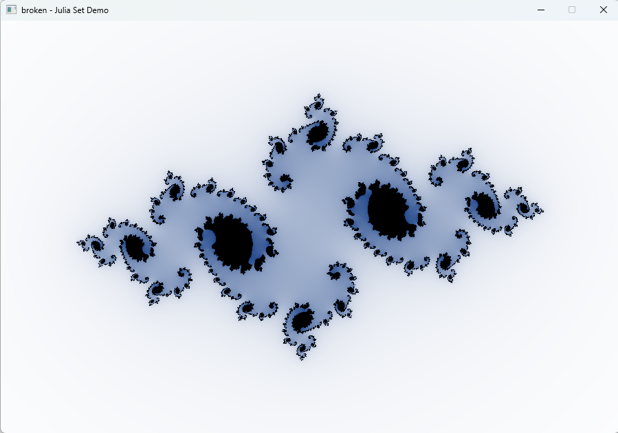
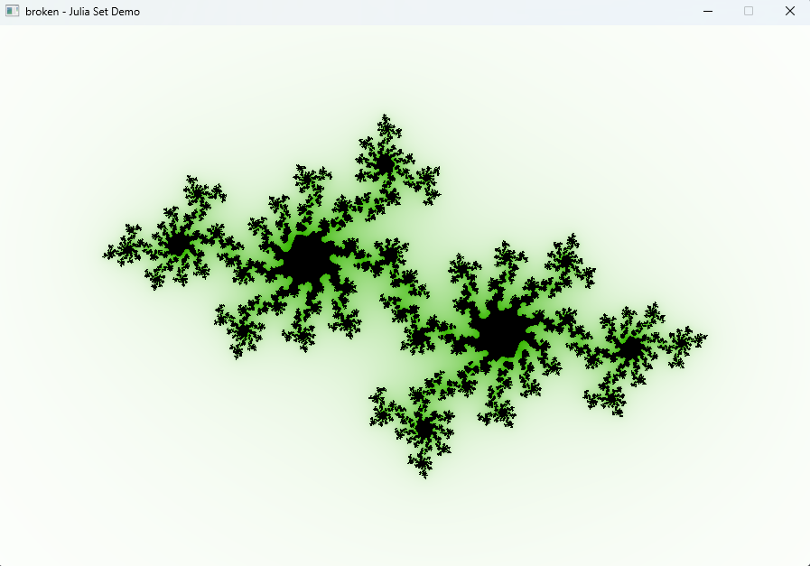
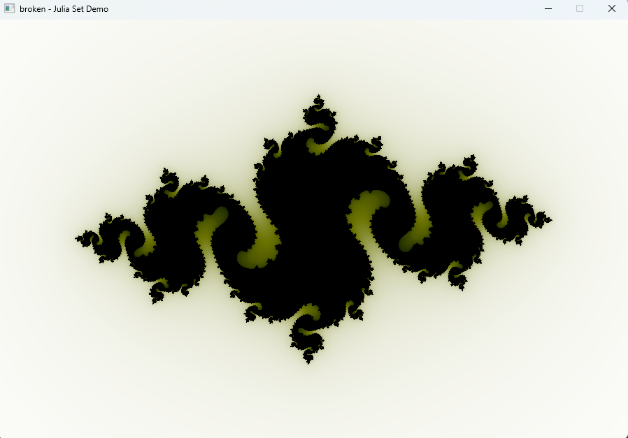

# broken
### A modern C++ renderer designed for clarity, modularity, and learning.

broken is a lightweight rendering engine built from the ground up to demonstrate modern graphics programming patterns.

### Project Structure

The codebase is organized to separate the engine core from the user application:

```
├── broken/                         # core engine (static library)
├── plugins/
│   │   ├── vulkan_renderer/        # vulkan rendering plugin (dynamic library)
├── sandbox/                        # sandbox test application (executable)
└── CMakeLists.txt
```

## Prerequisites

- C++ Compiler: Support for C++20 (MSVC 19.29+, GCC 10+, or Clang 13+).
- CMake: 3.15+.
- Vulkan SDK 1.4+.
- Python 3.14+.

#### 1. Install Vulkan SDK

Before installing the SDK, ensure your GPU drivers are up to date. The Vulkan Loader (required to run applications) is typically bundled with vendor driver packages (NVIDIA, AMD, Intel).

- Go to the official [LunarG Vulkan SDK](https://vulkan.lunarg.com/sdk/home) website.
- Select your operating system (Windows, Linux, or macOS).
- Choose the latest stable version (e.g., 1.4.335.0).

#### 2. Install Python

- Go to the official [Python](https://www.python.org/downloads/) website.
- Select your operating system (Windows, Linux, or macOS).
- Choose the latest stable version (e.g., 3.14.2).

## Build

```bash
$ git clone https://github.com/freakMeduza/broken.git
```

All platforms depend on CMake, 3.15.0 or higher, to generate IDE/make files. Ensure you are using a compiler with full C++20 support.

```bash
$ cmake -S broken -B build -D CMAKE_BUILD_TYPE=Release
$ cmake --build build --target sandbox
```

## Sandbox

To configure the sandbox application, you need to use a configuration file. Place it next to the executable file with name *sandbox.json*, or it will be created automatically on first run. You can also use the cmake option to automatically generate a *sandbox.json* file for the specific template.

```
{
    "rendering": {
        "name": "",
        "path": "",
        "window": {
            "width": 800,
            "height": 800,
            "title": "broken"
        },
        "device": {
            "validation": false
        },
        "pipelines": []
    }
}
```

Specify the absolute *path* to the rendering plugin's shared library file. This will allow us to open the application window, initialize the rendering backend, and enter the main event loop.

The *pipelines* array may contain a sequence of pipelines that will be executed in the specified order

```
"pipelines": [
    {
        "path": ".../shaders/shader_1.comp"
    },
    {
        "path": ".../shaders/shader_2.comp"
    }
]
```

#### Julia Set Demo

Set up cmake option ```SANDBOX_GENERATE_JULIA_SET_TEMPLATE``` to generate 'Julia Set Demo' configuration file

```
option(SANDBOX_GENERATE_JULIA_SET_TEMPLATE "Generate 'sandbox.json' with 'Julia Set Demo' template" ON)
```







## Dependencies
- [Python3](https://www.python.org/downloads/)
- [VulkanSDK](https://www.khronos.org/vulkan)
- [GLFW](https://github.com/glfw/glfw)
- [SPIRV-Headers](https://github.com/KhronosGroup/SPIRV-Headers)
- [SPIRV-Tools](https://github.com/KhronosGroup/SPIRV-Tools)
- [glslang](https://github.com/KhronosGroup/glslang)
- [nlohmann_json](https://github.com/nlohmann/json)